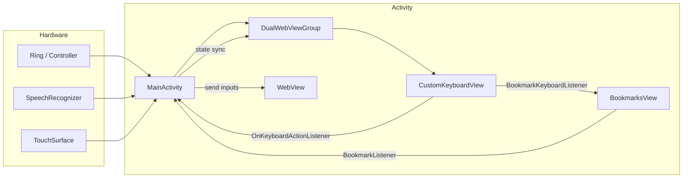
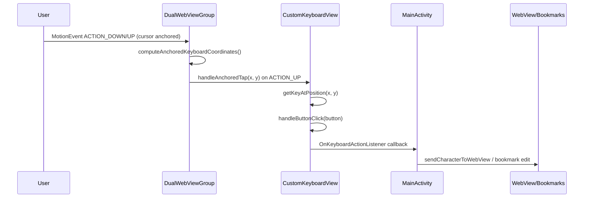

# TapLink X3

TapLink X3 is an Android-based browser shell designed for XR headsets that mirrors a dual-eye viewport, overlays a precision cursor, and exposes a custom radial keyboard that can be anchored to the viewport or controlled via spatial gestures. The application focuses on keeping input predictable when the user is navigating web content from a wearable controller.

## Highlights

- **Dual-eye rendering** that mirrors a single `WebView` into a left-eye clip with a cursor and a right-eye `SurfaceView` preview. 【F:app/src/main/java/com/TapLink/app/DualWebViewGroup.kt†L40-L84】
- **Custom keyboard** with anchored and focus-driven modes, supporting casing toggles, symbol layouts, and dynamic buttons wired through `CustomKeyboardView`. 【F:app/src/main/java/com/TapLink/app/CustomKeyboardView.kt†L101-L339】
- **Navigation and triple-click overlays** supplying quick actions, bookmarking, and anchor toggles from `DualWebViewGroup` and `TripleClickMenu`. 【F:app/src/main/java/com/TapLink/app/DualWebViewGroup.kt†L90-L148】【F:app/src/main/java/com/TapLink/app/tripleClickMenu.kt†L72-L190】
- **Persistent bookmarks** managed through `BookmarksView` with storage handled by `BookmarkManager`. 【F:app/src/main/java/com/TapLink/app/BookmarksView.kt†L24-L120】

## Project layout

```
.
├── app/                     # Android application module
│   ├── src/main/java/com/TapLink/app/
│   │   ├── DualWebViewGroup.kt
│   │   ├── CustomKeyboardView.kt
│   │   ├── MainActivity.kt
│   │   ├── BookmarksView.kt
│   │   ├── tripleClickMenu.kt
│   │   ├── SystemInfoView.kt
│   │   └── MyApplication.kt
│   └── src/main/res/        # Layouts, drawables, menus, etc.
├── build.gradle.kts         # Root Gradle configuration
└── settings.gradle.kts
```

## Build & run

1. Install Android Studio (Giraffe or newer) with Android SDK 33.
2. Import the repository as a Gradle project.
3. Select the `app` run configuration and deploy to an Android 10 (API 29) or newer device/headset.
4. The default start URL is derived from the bookmark home entry; the keyboard opens via the navigation bar or triple-click menu.

Gradle wrapper commands are available for CI:

```bash
./gradlew assembleDebug
./gradlew test
```

## Architectural overview

TapLink revolves around `MainActivity`, which wires input devices, audio, speech recognition, and the dual-eye surface. `DualWebViewGroup` hosts the left eye UI stack (navigation, keyboard container, bookmarks) and mirrors frames to the right eye. Input funnels through `CustomKeyboardView` and `LinkEditingListener` callbacks so that keyboard interactions can either populate the WebView or manipulate bookmark fields. 【F:app/src/main/java/com/TapLink/app/MainActivity.kt†L3720-L3826】【F:app/src/main/java/com/TapLink/app/DualWebViewGroup.kt†L40-L214】

### Core data flow



This chart captures how controller, speech, and touch events enter `MainActivity`, which orchestrates the `DualWebViewGroup`. Keyboard callbacks loop through the `OnKeyboardActionListener` interface implemented by `MainActivity` to ultimately send text or commands to the `WebView` or bookmark editors. 【F:app/src/main/java/com/TapLink/app/MainActivity.kt†L3720-L3826】【F:app/src/main/java/com/TapLink/app/CustomKeyboardView.kt†L101-L339】

## Input modes

TapLink exposes two complementary keyboard modes:

- **Anchored mode**: The keyboard is fixed in the viewport and taps are redirected based on the cursor location. Drag and fling listeners are suppressed so only discrete taps are processed. 【F:app/src/main/java/com/TapLink/app/DualWebViewGroup.kt†L1495-L1689】【F:app/src/main/java/com/TapLink/app/CustomKeyboardView.kt†L173-L207】【F:app/src/main/java/com/TapLink/app/CustomKeyboardView.kt†L626-L716】
- **Free (focus) mode**: The keyboard is navigated via horizontal drags and flings that move the focus highlight before triggering `performFocusedTap()`. 【F:app/src/main/java/com/TapLink/app/DualWebViewGroup.kt†L1689-L1708】【F:app/src/main/java/com/TapLink/app/CustomKeyboardView.kt†L626-L716】

### Anchored tap pipeline



In anchored mode, drag and fling routines (`handleDrag`, `handleFlingEvent`) bail early so only the anchored tap path fires. Once `handleAnchoredTap` identifies the target key it forwards to `handleButtonClick`, which emits callbacks such as `onKeyPressed`, `onEnterPressed`, or `onHideKeyboard`. `MainActivity` routes those callbacks to the active destination—either the inline URL editor, bookmark panel, or the `WebView`. 【F:app/src/main/java/com/TapLink/app/DualWebViewGroup.kt†L1495-L1689】【F:app/src/main/java/com/TapLink/app/CustomKeyboardView.kt†L173-L339】【F:app/src/main/java/com/TapLink/app/MainActivity.kt†L3720-L3826】

### Focus-driven tap pipeline

When the keyboard is unanchored, `DualWebViewGroup` ignores anchored interception and instead forwards drag events to `CustomKeyboardView.handleDrag`, which advances the highlighted key. A tap (`ACTION_UP`) invokes `performFocusedTap()` so the currently focused button emits callbacks without cursor remapping. 【F:app/src/main/java/com/TapLink/app/DualWebViewGroup.kt†L1641-L1708】【F:app/src/main/java/com/TapLink/app/CustomKeyboardView.kt†L626-L716】

## Bookmark management

Bookmarks persist inside `BookmarkManager`, which stores entries in shared preferences. The `BookmarksView` exposes navigation, editing, and keyboard integration via `BookmarkListener`, `BookmarkKeyboardListener`, and `BookmarkStateListener`. `MainActivity` implements these hooks to open URLs, edit titles, and inject keyboard characters. 【F:app/src/main/java/com/TapLink/app/BookmarksView.kt†L24-L230】【F:app/src/main/java/com/TapLink/app/MainActivity.kt†L3775-L3826】

## Further reading

- [`docs/anchored-mode.md`](docs/anchored-mode.md) – deep dive into anchored input handling and listener behavior.
- [`app/src/main/java/com/TapLink/app/MainActivity.kt`](app/src/main/java/com/TapLink/app/MainActivity.kt) – orchestrates sensors, IPC, and keyboard callbacks.

## Credits

The original TapLink builds and documentation were published through the release log hosted at https://pastebin.com/80GGhiEK. To preserve that history inside the repository, the paste contents are reproduced below with light formatting for readability.

### TapLink 0.8 (February 16, 2025)

- **APK**: https://drive.google.com/file/d/1f-boxhhJZGgNInatY--o-o_nFf5nBQom/view?usp=sharing
- **Source code**: https://drive.google.com/file/d/166d1YZkIudaWRL3s-dgMbFl1nxVcar1w/view?usp=sharing
- **User manual**: https://docs.google.com/document/d/17fQSFXuJ2TSDNZI_BWqN8VYXzL9PbLomck5P_oVQGgY/edit?usp=sharing
- **Installation video**: https://www.youtube.com/watch?v=YbpOECQwUqA
- **Buy Me a Coffee**: https://buymeacoffee.com/glxblt76
- **New features**:
  - Ring is now usable.
  - Button to disable or enable the ring when connected.
  - Settings menu with control bars for sound and brightness within the app.
  - Click responsiveness tuned toward single-tap actions.

### TapLink 0.7 (January 31, 2025)

- **APK**: https://drive.google.com/file/d/1GCG470DYCTYRoGAVKrRgUBLOVwotS0FH/view?usp=drive_link
- **Source code**: https://drive.google.com/file/d/1hMu-HV_3HmPzcafG3BxCa0DZoCiIh_EJ/view?usp=drive_link
- **User manual**: https://docs.google.com/document/d/10zcz3f9sqT_1Ajc4GtTVdPpgT61TWnQQOQtzQ_hI77M/edit?usp=sharing
- **Installation video**: https://www.youtube.com/watch?v=YbpOECQwUqA
- **Buy Me a Coffee**: https://buymeacoffee.com/glxblt76
- **New features**:
  - Triple tap menu for quick access to key features.
  - Triple tap re-centers the screen while anchored.
  - Automatic switch to scroll mode after 30 seconds of inactivity.
  - Icons hidden while in scroll mode.
  - Scroll mode uses the full display area.
- **Bug fixes**:
  - Anchored mode stability issues causing crashes.
  - Toggle bar visibility on start.
  - Anchored mode disabling when pausing the glasses.
  - Narrow bar taps not registering reliably in anchored mode.
  - Google News articles occasionally failing to open.
- **Known issue**: Wait 1–2 seconds after starting the app before opening the triple click menu so the layout initializes correctly.

### TapLink 0.6 (January 4, 2025)

- **APK**: https://drive.google.com/file/d/1ZI6Id-gIQyuSQfkED_En_7navtj_jCqT/view?usp=sharing
- **Source code**: https://drive.google.com/file/d/1MCT2qsbvmG_qN123_wcqDcdpWG4XDzxC/view?usp=sharing
- **User manual**: https://docs.google.com/document/d/1SL71v3zO5dgM50mj-ONvj9IhHHxMZbH3wMV3tZqadCk/edit?usp=sharing
- **Installation video**: https://www.youtube.com/watch?v=YbpOECQwUqA
- **New feature**:
  - Added 3DoF support that anchors the screen for head-tracked cursor control and enables anchored keyboard interaction. Headlock engages automatically when the screen is masked to conserve battery.
- **Bug fix**:
  - Restored a missing keyboard logic path that previously degraded usability.

### TapLink 0.5 (December 31, 2024)

- **APK**: https://drive.google.com/file/d/16wnXnV3jzV0U4ov37aFWr7udvEBmN3Ge/view?usp=drive_link
- **Source code**: https://drive.google.com/file/d/1Tbnhowdqbxx80L6z7nUrrGWO2UVmtm40/view?usp=drive_link
- **User manual**: https://docs.google.com/document/d/1ykANYskiOYH7Fj3vaxtB-zlsySyco4T2hO26sDVBQo8/edit?usp=sharing
- **Installation video**: https://www.youtube.com/watch?v=YbpOECQwUqA
- **New features**:
  - Clickable scrolling buttons as an alternative to scroll mode.
  - Zoom in/out controls.
  - Screen masking button for unobstructed AI interactions.
  - Compact system information bar showing connectivity, battery, time, and date.

### TapLink 0.4.1 (December 25, 2024)

- **APK**: https://drive.google.com/file/d/1_MAcOS0G7pkMHSf7U4DWUipRYGCxdOKc/view?usp=sharing
- **Source code**: https://drive.google.com/file/d/1TG8kboufhzuOpPkI5hyrgqbX_GbU5DKS/view?usp=sharing
- **User manual**: https://docs.google.com/document/d/1ykANYskiOYH7Fj3vaxtB-zlsySyco4T2hO26sDVBQo8/edit?usp=sharing
- **Installation video**: https://www.youtube.com/watch?v=YbpOECQwUqA
- **Bug fixes**:
  - Keyboard appearing in unintended contexts.
  - Clear key intermittently failing.

### TapLink 0.4 (December 24, 2024)

- **APK**: https://drive.google.com/file/d/1n-9WMxwChp22HdXloPg14M_hy-2a0gTq/view?usp=sharing
- **Source code**: https://drive.google.com/file/d/1UZfHvoZ5T3dSkNzQ9pu2uSdPvykRaqPM/view?usp=sharing
- **User manual**: https://docs.google.com/document/d/1ykANYskiOYH7Fj3vaxtB-zlsySyco4T2hO26sDVBQo8/edit?usp=sharing
- **Installation video**: https://www.youtube.com/watch?v=YbpOECQwUqA
- **New features**:
  - Bookmark support with a dedicated YouTube quick link.
  - Customizable home bookmark controlling the start page.
  - Broader keyboard input field detection.
  - Camera and microphone access (subject to Chromium WebView compatibility).
  - Session restoration that returns to the last visited page.
- **Bug fixes**:
  - Logging issues affecting Google services.
  - Rendering of Google’s landing page.

