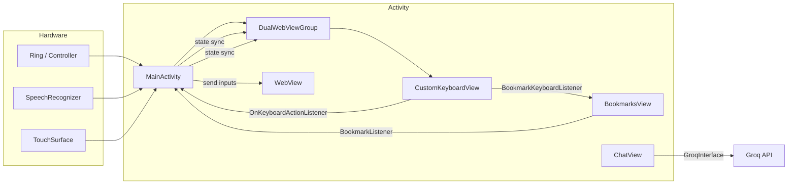

# Architecture Overview

TapLink revolves around `MainActivity`, which wires input devices, audio, speech recognition, and the dual-eye surface. `DualWebViewGroup` hosts the left eye UI stack (navigation, keyboard container, bookmarks) and mirrors frames to the right eye. Input funnels through `CustomKeyboardView` and `LinkEditingListener` callbacks so that keyboard interactions can either populate the WebView or manipulate bookmark fields. 【F:app/src/main/java/com/TapLink/app/MainActivity.kt†L3848-L3990】【F:app/src/main/java/com/TapLink/app/DualWebViewGroup.kt†L51-L214】

## Core data flow

This chart captures how controller, speech, and touch events enter `MainActivity`, which orchestrates the `DualWebViewGroup`. Keyboard callbacks loop through the `OnKeyboardActionListener` interface implemented by `MainActivity` to ultimately send text or commands to the `WebView` or bookmark editors. 【F:app/src/main/java/com/TapLink/app/MainActivity.kt†L3848-L3940】【F:app/src/main/java/com/TapLink/app/CustomKeyboardView.kt†L173-L260】

## Bookmark management

Bookmarks persist inside `BookmarkManager`, which stores entries in shared preferences. The `BookmarksView` exposes navigation, editing, and keyboard integration via `BookmarkListener`, `BookmarkKeyboardListener`, and `BookmarkStateListener`. `MainActivity` implements these hooks to open URLs, edit titles, and inject keyboard characters. 【F:app/src/main/java/com/TapLink/app/BookmarksView.kt†L21-L233】【F:app/src/main/java/com/TapLink/app/BookmarksView.kt†L640-L718】【F:app/src/main/java/com/TapLink/app/MainActivity.kt†L3848-L3940】

## TapLink AI
The TapLink AI lives in `ChatView`, a dedicated window managed by `DualWebViewGroup`. It uses `GroqInterface` to communicate with the Groq API (using the `groq/compound` model) and renders a clean HTML interface (`clean_chat.html`). See [TAPLINK_AI.md](TAPLINK_AI.md) for details.
