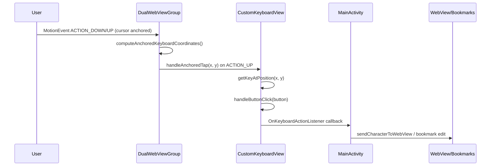

# Input Systems

TapLink exposes two complementary keyboard modes:

- **Anchored mode**: The keyboard is fixed in the viewport and taps are redirected based on the cursor location. Drag and fling listeners are suppressed so only discrete taps are processed. 【F:app/src/main/java/com/TapLink/app/DualWebViewGroup.kt†L1592-L1774】【F:app/src/main/java/com/TapLink/app/CustomKeyboardView.kt†L173-L260】【F:app/src/main/java/com/TapLink/app/CustomKeyboardView.kt†L648-L716】
- **Free (focus) mode**: The keyboard is navigated via horizontal drags and flings that move the focus highlight before triggering `performFocusedTap()`. 【F:app/src/main/java/com/TapLink/app/DualWebViewGroup.kt†L1650-L1664】【F:app/src/main/java/com/TapLink/app/DualWebViewGroup.kt†L1785-L1803】【F:app/src/main/java/com/TapLink/app/CustomKeyboardView.kt†L648-L716】

## Anchored tap pipeline

In anchored mode, drag and fling routines (`handleDrag`, `handleFlingEvent`) bail early so only the anchored tap path fires. Once `handleAnchoredTap` identifies the target key it forwards to `handleButtonClick`, which emits callbacks such as `onKeyPressed`, `onEnterPressed`, or `onHideKeyboard`. `MainActivity` routes those callbacks to the active destination—either the inline URL editor, bookmark panel, or the `WebView`. 【F:app/src/main/java/com/TapLink/app/DualWebViewGroup.kt†L1592-L1774】【F:app/src/main/java/com/TapLink/app/CustomKeyboardView.kt†L173-L260】【F:app/src/main/java/com/TapLink/app/MainActivity.kt†L3848-L3940】

## Focus-driven tap pipeline

When the keyboard is unanchored, `DualWebViewGroup` ignores anchored interception and instead forwards drag events to `CustomKeyboardView.handleDrag`, which advances the highlighted key. A tap (`ACTION_UP`) invokes `performFocusedTap()` so the currently focused button emits callbacks without cursor remapping. 【F:app/src/main/java/com/TapLink/app/DualWebViewGroup.kt†L1650-L1664】【F:app/src/main/java/com/TapLink/app/DualWebViewGroup.kt†L1785-L1803】【F:app/src/main/java/com/TapLink/app/CustomKeyboardView.kt†L648-L716】

For a deeper dive into anchored input handling, see [Anchored Keyboard Mode](anchored-mode.md).
