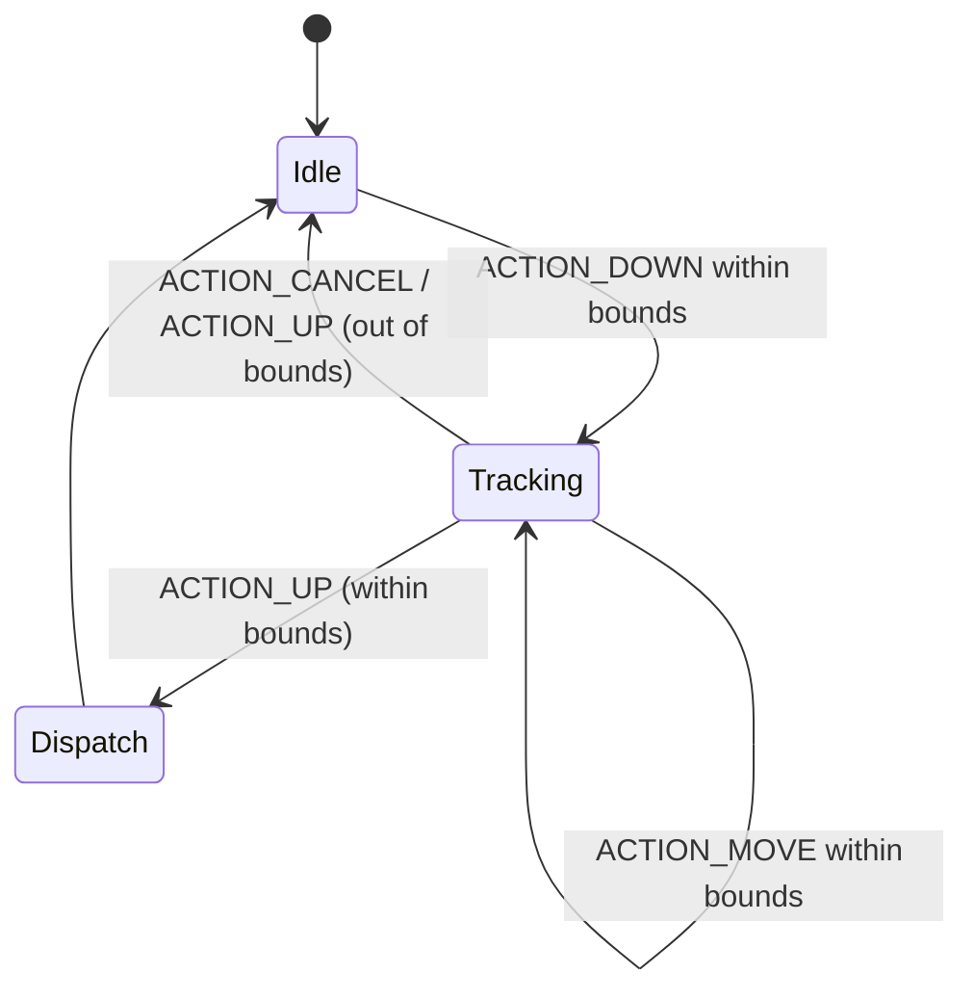

# Anchored keyboard mode

Anchored keyboard mode pins the on-screen keyboard relative to the viewport instead of the controller. The cursor is the only moving element; taps are projected from the cursor into the keyboard so users can "poke" at keys while the keyboard remains stationary.

## Gesture interception

When the keyboard is visible and the layout reports `isAnchored = true`, `DualWebViewGroup.onInterceptTouchEvent` checks whether the cursor projection falls inside the keyboard bounds. Any qualifying `ACTION_DOWN`, `ACTION_MOVE`, or `ACTION_UP` event is intercepted and marked as an anchored gesture. 【F:app/src/main/java/com/TapLink/app/DualWebViewGroup.kt†L1592-L1650】

`onTouchEvent` then consumes the matching `ACTION_UP` event, recalculates the cursor-aligned keyboard coordinates, and forwards the tap to `CustomKeyboardView.handleAnchoredTap`. Drag and cancel events simply keep the interception state in sync. 【F:app/src/main/java/com/TapLink/app/DualWebViewGroup.kt†L1729-L1803】

## Listener routing

Once `handleAnchoredTap` is invoked, `CustomKeyboardView` resolves the button under the projected coordinates and emits an `OnKeyboardActionListener` callback. `MainActivity` implements this interface to distribute the action to the active surface (bookmark editor, URL bar, or WebView). 【F:app/src/main/java/com/TapLink/app/CustomKeyboardView.kt†L173-L260】【F:app/src/main/java/com/TapLink/app/MainActivity.kt†L3848-L3940】

| Input listener | Anchored mode behavior | Relevant implementation |
| --- | --- | --- |
| `handleDrag` (`CustomKeyboardView`) | **Ignored** – returns immediately when `isAnchoredMode` is `true`. | 【F:app/src/main/java/com/TapLink/app/CustomKeyboardView.kt†L648-L716】 |
| `handleFlingEvent` (`CustomKeyboardView`) | **Ignored** – flings short-circuit before moving focus. | 【F:app/src/main/java/com/TapLink/app/CustomKeyboardView.kt†L648-L681】 |
| `performFocusedTap` (`CustomKeyboardView`) | **Unused** – taps are routed through cursor projection, not focus. | 【F:app/src/main/java/com/TapLink/app/DualWebViewGroup.kt†L1785-L1803】 |
| `handleAnchoredTap` (`CustomKeyboardView`) | **Active** – resolves the key and triggers `handleButtonClick`. | 【F:app/src/main/java/com/TapLink/app/CustomKeyboardView.kt†L173-L260】 |
| `OnKeyboardActionListener` (`MainActivity`) | **Active** – receives callbacks such as `onKeyPressed`, `onBackspacePressed`, and `onEnterPressed`. | 【F:app/src/main/java/com/TapLink/app/MainActivity.kt†L3848-L3940】 |

## Result delivery

Depending on the callback, `MainActivity` performs one of three actions:

1. **Bookmark navigation/editing** – when the bookmarks drawer is expanded, `onKeyPressed` and `onBackspacePressed` target `BookmarksView.handleKeyboardInput`. 【F:app/src/main/java/com/TapLink/app/MainActivity.kt†L3848-L3908】
2. **URL editing** – if the inline URL field is visible, characters are inserted directly into `DualWebViewGroup.urlEditText`. 【F:app/src/main/java/com/TapLink/app/MainActivity.kt†L3848-L3899】
3. **Web content input** – otherwise, characters and commands are sent to the embedded `WebView` via JavaScript bridges. 【F:app/src/main/java/com/TapLink/app/MainActivity.kt†L3870-L3940】

This routing ensures anchored taps behave consistently regardless of which overlay is active.

## Credits

The original TapLink release log at https://pastebin.com/80GGhiEK captures how anchored interactions evolved across versions. Relevant excerpts are preserved here for easy reference:

- **TapLink 0.8 (February 16, 2025)** – Enabled the ring controller, added an in-app toggle to disable it, exposed sound and brightness sliders, and tuned tap responsiveness for anchored clicking.
- **TapLink 0.7 (January 31, 2025)** – Introduced the triple tap menu for rapid feature access, ensured triple tap recenters anchored layouts, and fixed several anchored-mode reliability issues (crashes, toggle visibility, loss of anchored state, and narrow-target taps).
- **TapLink 0.6 (January 4, 2025)** – Delivered 3DoF support so the cursor and keyboard could be controlled by head tracking when anchored, plus a keyboard logic fix that improved input fidelity.
- **TapLink 0.5 (December 31, 2024)** – Added UI affordances like clickable scroll buttons, zoom controls, a screen mask, and a compact status bar to complement anchored browsing.
- **TapLink 0.4.1 (December 25, 2024)** – Addressed mis-positioned keyboards and clear-button reliability problems that affected anchored typing.
- **TapLink 0.4 (December 24, 2024)** – Brought bookmarks, a customizable home link, broader input-field detection, camera/microphone support, and session restoration—features that defined the anchored experience inherited by TapLink X3.

For the full list of download links and documentation preserved from the original project, see the [Credits section of the README](../README.md#credits).

