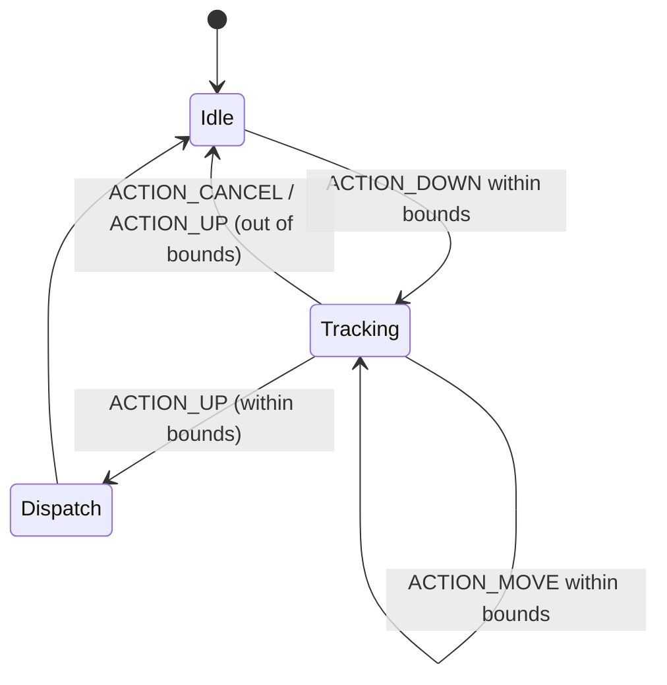

# Anchored interaction mode

Anchored mode pins interactive UI elements (keyboard, bookmarks, menu) relative to the viewport. The cursor is the primary moving element; taps and gestures are projected from the cursor into the target view so users can "poke" at keys or scroll lists while the UI remains stationary.

## Gesture interception

When `isAnchored = true`, `DualWebViewGroup.onInterceptTouchEvent` checks whether the cursor projection falls inside the bounds of active targets (Keyboard, Bookmarks, or Triple-click Menu). Any qualifying `ACTION_DOWN`, `ACTION_MOVE`, or `ACTION_UP` event within these bounds is intercepted and marked as an anchored gesture. 【F:app/src/main/java/com/TapLink/app/DualWebViewGroup.kt†L1592-L1650】

`onTouchEvent` then consumes the matching events. For taps, it recalculates the cursor-aligned coordinates and forwards the action to the target view (e.g., `CustomKeyboardView.handleAnchoredTap` or `BookmarksView.handleAnchoredTap`). For drags (bookmarks), it calculates vertical deltas and calls `handleAnchoredSwipe`. 【F:app/src/main/java/com/TapLink/app/DualWebViewGroup.kt†L1729-L1803】

```mermaid
stateDiagram-v2
    [*] --> Idle
    Idle --> Tracking : ACTION_DOWN within bounds
    Tracking --> Tracking : ACTION_MOVE within bounds
    Tracking --> Dispatch : ACTION_UP (within bounds)
    Tracking --> Idle : ACTION_CANCEL / ACTION_UP (out of bounds)
    Dispatch --> Idle
```

## Listener routing

Once an anchored gesture is confirmed, `DualWebViewGroup` dispatches the event to the appropriate target:

- **Keyboard**: Calls `CustomKeyboardView.handleAnchoredTap`. The view resolves the button and emits an `OnKeyboardActionListener` callback.
- **Bookmarks**: Calls `BookmarksView.handleAnchoredTap` or `handleAnchoredSwipe`.
- **Triple-click Menu**: Calls `TripleClickMenu.handleAnchoredTap`.

`MainActivity` implements `OnKeyboardActionListener` to distribute keyboard actions to the active surface. 【F:app/src/main/java/com/TapLink/app/CustomKeyboardView.kt†L173-L260】【F:app/src/main/java/com/TapLink/app/MainActivity.kt†L3848-L3940】

| Input listener | Anchored mode behavior | Relevant implementation |
| --- | --- | --- |
| `handleDrag` (`CustomKeyboardView`) | **Ignored** – returns immediately when `isAnchoredMode` is `true`. | 【F:app/src/main/java/com/TapLink/app/CustomKeyboardView.kt†L648-L716】 |
| `handleFlingEvent` (`CustomKeyboardView`) | **Ignored** – flings short-circuit before moving focus. | 【F:app/src/main/java/com/TapLink/app/CustomKeyboardView.kt†L648-L681】 |
| `performFocusedTap` (`CustomKeyboardView`) | **Unused** – taps are routed through cursor projection, not focus. | 【F:app/src/main/java/com/TapLink/app/DualWebViewGroup.kt†L1785-L1803】 |
| `handleAnchoredTap` (`CustomKeyboardView`) | **Active** – resolves the key and triggers `handleButtonClick`. | 【F:app/src/main/java/com/TapLink/app/CustomKeyboardView.kt†L173-L260】 |
| `OnKeyboardActionListener` (`MainActivity`) | **Active** – receives callbacks such as `onKeyPressed`, `onBackspacePressed`, and `onEnterPressed`. | 【F:app/src/main/java/com/TapLink/app/MainActivity.kt†L3848-L3940】 |

## Result delivery

Depending on the callback, `MainActivity` performs one of three actions:

1. **Bookmark navigation/editing** – when the bookmarks drawer is expanded, `onKeyPressed` and `onBackspacePressed` target `BookmarksView.handleKeyboardInput`. 【F:app/src/main/java/com/TapLink/app/MainActivity.kt†L3848-L3908】
2. **URL editing** – if the inline URL field is visible, characters are inserted directly into `DualWebViewGroup.urlEditText`. 【F:app/src/main/java/com/TapLink/app/MainActivity.kt†L3848-L3899】
3. **Web content input** – otherwise, characters and commands are sent to the embedded `WebView` via JavaScript bridges. 【F:app/src/main/java/com/TapLink/app/MainActivity.kt†L3870-L3940】

This routing ensures anchored taps behave consistently regardless of which overlay is active.
